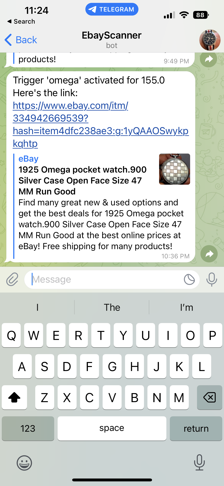

# WatchBot: Finding good deals on eBay

I enjoy antiquing and collecting watches, but as a student I seldom have the time or money to go out watch shopping. This bot runs in the background, constantly scraping the newly listed ebay watches that meet certain keyword/ price requirements that are configurable by the user. I only scrape listings with a "buy it now" option. With some small parameter changes, this bot could scrape for anything. Valid listings are sent directly to my phone via the Telegram API (similar to a text message or whatsapp). Download this repo and change the parameters in poll.py to search for anything on eBay.

## Current renovations

The data_management folder and models folder contain the early makings of a large NN for classifying watch images. With keyword search, all listings in which sellers aren't sure what they have are lost. I've created a database of nearly 100,000 labeled images and am working on a CNN classifier by brand.

# Use this yourself

The poll.py file is the only file that needs to be run for the bot to run in perpetuity. Replace with your keywords and your telegram chat_id and bot's unique token. The link to generate those is in that file.

